# 📚 도서관 관리 시스템 (Library Management System)

> Spring Boot 기반 시립 도서관 운영 플랫폼  
> 일반 회원과 관리자를 지원하는 웹 애플리케이션

---

## 🛠 기술 스택

| 구분 | 기술 |
|------|------|
| Backend | Spring Boot 3.5.11, Java 17 |
| ORM | Spring Data JPA + Hibernate, QueryDSL 5.0.0 |
| Template | Thymeleaf + Bootstrap |
| Security | Spring Security (세션 기반 + 인터셉터) |
| Database | MariaDB |
| API 문서 | SpringDoc OpenAPI (Swagger UI) |
| 외부 API | 기상청 초단기실황 API, 네이버 책 검색 API |
| 빌드 도구 | Gradle |

---

## 📁 프로젝트 구조

```mermaid
graph TD
    ROOT["📦 src/main"]

    ROOT --> JAVA["📂 java/com/library/project/library"]
    ROOT --> RES["📂 resources"]

    JAVA --> CFG["📂 config\nSecurity · Interceptor · Swagger"]
    JAVA --> CTR["📂 controller\nView + REST 컨트롤러"]
    JAVA --> ENT["📂 entity/domain\nJPA 엔티티"]
    JAVA --> REP["📂 repository\n데이터 접근 계층 + QueryDSL"]
    JAVA --> SVC["📂 service\n비즈니스 로직"]
    JAVA --> DTO["📂 dto\n데이터 전송 객체"]
    JAVA --> ENM["📂 enums\nEnum 상수 정의"]
    JAVA --> EXC["📂 exception\n전역 예외 처리"]

    RES --> TPL["📂 templates\nThymeleaf HTML (40+ 페이지)"]
    RES --> STT["📂 static\nCSS · JS · Images"]
    RES --> PRP["📜 application.properties"]

    style ROOT fill:#6d4aff,color:#fff,stroke:none
    style JAVA fill:#4a90d9,color:#fff,stroke:none
    style RES fill:#4a90d9,color:#fff,stroke:none
    style CFG fill:#e8f4fd,stroke:#4a90d9
    style CTR fill:#e8f4fd,stroke:#4a90d9
    style ENT fill:#e8f4fd,stroke:#4a90d9
    style REP fill:#e8f4fd,stroke:#4a90d9
    style SVC fill:#e8f4fd,stroke:#4a90d9
    style DTO fill:#e8f4fd,stroke:#4a90d9
    style ENM fill:#e8f4fd,stroke:#4a90d9
    style EXC fill:#fdeaea,stroke:#d9534a
    style TPL fill:#eafdf0,stroke:#4aad5a
    style STT fill:#eafdf0,stroke:#4aad5a
    style PRP fill:#eafdf0,stroke:#4aad5a
```



---

## ✨ 주요 기능

### 👤 회원 관리
- 회원가입, 로그인/로그아웃 (세션 기반)
- 아이디 찾기, 비밀번호 재설정
- 마이페이지 관리

### 📖 도서 관리 및 검색
- ISBN 기반 도서 목록, 초성 검색 지원
- 정렬: 등록순 / 출판일 / 추천수 / 대출빈도
- 도서 추천(♡/♥) 기능

### 🔄 대출/반납 시스템
- 14일 대출 기간, 1일 최대 3권 제한
- 중복 대출 방지, 반납, 연장(1회 한정)
- 대출 이력 조회

### 📅 행사/이벤트
- 강좌 / 영화상영 / 행사 3가지 카테고리
- 행사 신청(중복 방지), 캘린더 뷰 제공

### 📢 공지사항
- 관리자 전용 등록·수정·삭제
- 다중 이미지 첨부, 상단 고정, 조회수 추적

### 💬 문의사항 (Q&A)
- 문의 등록 (비밀글 지원)
- 관리자 답변 기능, 답변 수 표시

### 📦 비치희망도서 신청
- 도서 구입 요청 (이미지 첨부 가능)
- 상태 흐름: `신청중` → `심사중` → `구입중` → `정리중` → `이용가능 / 반려`

### 🏛 시설/공간 예약
- 시설 예약 신청서 제출 및 상태 추적

### 📋 도서관 정보
- 운영시간, 시설 안내, 조직도
- 자료현황 통계

### 🔐 인증/인가
- 세션 기반 인증 + `LoginCheck` / `AdminCheck` 인터셉터
- `USER` / `ADMIN` 역할 기반 접근 제어

---

## 🗄 아키텍처 및 DB 설계

### MVC 패턴 기반 레이어 구조

```
[Controller Layer]  →  요청 처리 분리 (View + REST 컨트롤러)
       ↓
[Service Layer]     →  트랜잭션 관리 및 비즈니스 로직
       ↓
[Repository Layer]  →  Spring Data JPA + QueryDSL
       ↓
[Database]          →  MariaDB (영구 데이터 저장소)
```

### 주요 DB 엔티티

`member` · `book` · `rental` · `library_event` · `event_application` · `notice` · `tbl_inquiry` · `reply` · `wish_book` · `book_request` · `recommend` · `library_info` · `library_stats`

---

## 📊 프로젝트 규모

- Java 파일 **125개 이상**
- HTML 페이지 **40개 이상**
- 패키지: `config` · `controller` · `entity` · `repository` · `service` · `dto` · `enums` · `exception`
